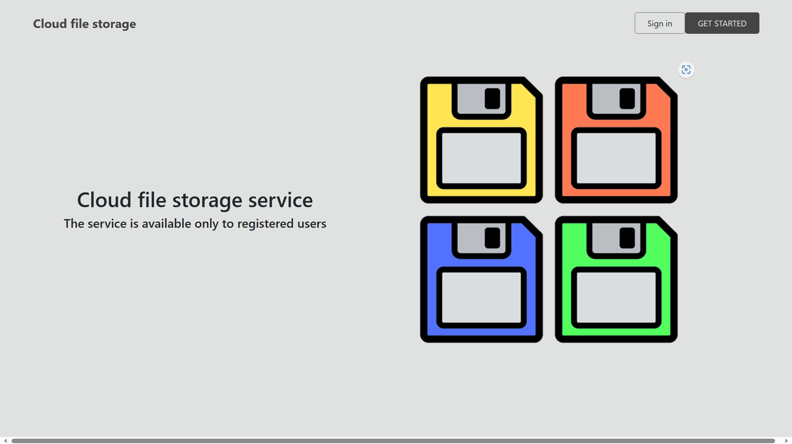
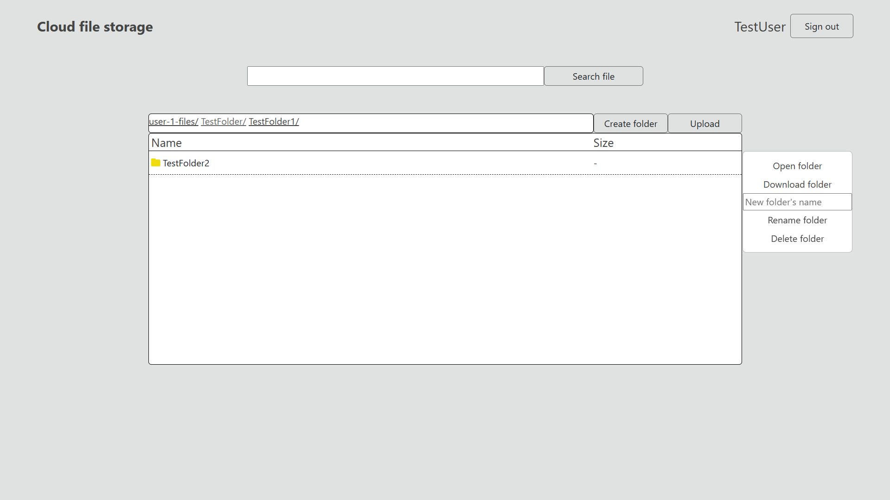
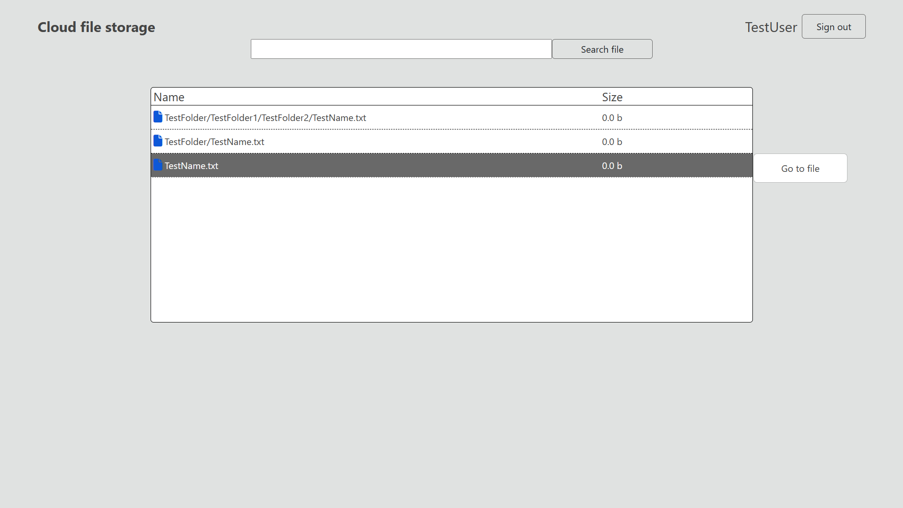
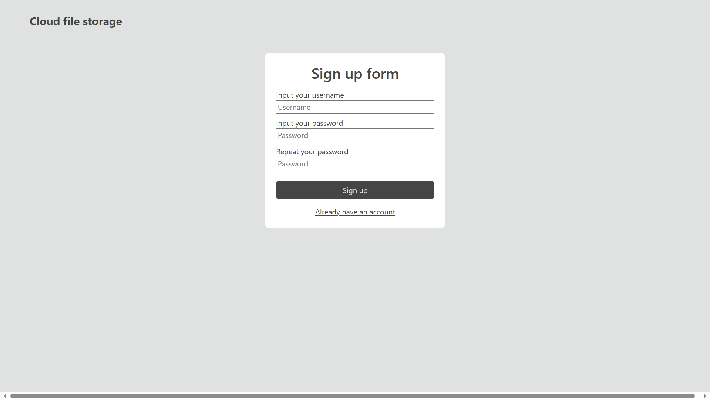
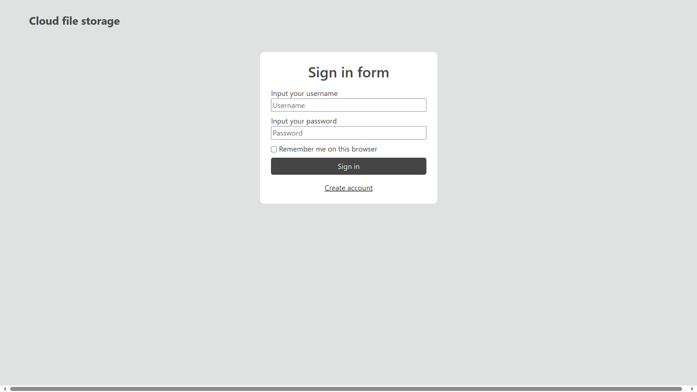

<h2>Облачное хранилище файлов</h2>

Многопользовательское файловое облако. Пользователи сервиса могут использовать его для загрузки и хранения файлов

Описание и ТЗ проекта доступно по адресу: https://zhukovsd.github.io/java-backend-learning-course/Projects/CloudFileStorage/

Приложение доступно по адресу: http://176.113.83.41:9091/

<h2>Мотивация проекта: </h2>
<ul>
<li>Использование возможностей Spring Boot</li>
<li>Практика с Docker и Docker Compose</li>
<li>Знакомство с NoSQL хранилищами - S3 для файлов, Redis для сессий</li>
</ul>

<h2>Быстрый запуск</h2>

Необходимо запустить файл compose.yaml в корне проекта (docker compose up) или compose-prod.yaml (docker compose -f compose-prod.yaml up)

<h2>Используемые технологии: </h2>
<ul>
<li>Java</li>
<li>Gradle</li>
<li>Spring Boot, Spring Security, Spring Sessions</li>
<li>SQL(MySQL)</li>
<li>NoSQL(Redis, MinIO)</li>
<li>Upload файлов, заголовки HTTP запросов, cookies, сессии</li>
<li>Thymeleaf</li>
<li>Spring Data JPA</li>
<li>Docker - контейнеры, образы, volumes, Docker Compose</li>
<li>Frontend - HTML/CSS, Bootstrap</li>
<li>Тесты - интеграционное тестирование, JUnit, Testcontainers</li>
</ul>

<h2>Функционал приложения</h2>
<h3>Работа с пользователями:</h3>
<ul>
<li>Регистрация</li>
<li>Авторизация</li>
<li>Logout</li>
</ul>

<h3>Работа с файлами и папками:</h3>

<ul>
<li>Создание новой пустой папки</li>
<li>Загрузка файлов и папок (установлен лимит в размере 1 ГБ)</li>
<liСкачивание файлов и папок></liСкачивание>
<li>Поиск файлов и папок</li>
<li>Переименование файлов и папок</li>
<li>Удаление файлов и папок</li>
</ul>

<h2>Интерфейс приложения</h2>
<h3>Заголовок</h3>
<ul>
<li>Для неавторизованных пользователей - кнопки регистрации и авторизации</li>
<li>Для авторизованных пользователей - логин текущего пользователя и кнопка Logout</li>
</ul>

<h3>Главная страница</h3>

Адрес - /?path=$path_to_subdirectory

Параметр $path задаёт путь просматриваемой папки. Если параметр отсутствует, подразумевается корневая папка.

Контент (только для авторизованных пользователей):

<ul>
<li>Форма поиска файлов и папок по названию</li>
<li>Навигационная цепочка (breadcrumbs), содержащая путь из папок до текущей папки. Каждый элемент является ссылкой на свою папку</li>
<li>Список файлов и папок в текущей директории. Для каждого файла отображается имя, размер и кнопка, вызывающая меню действий (загрузка, переименование, удаление)</li>
<li>Формы для загрузки файлов и папок</li>
</ul>

<h3>Страница поиска файлов и папок (доступна только авторизованным пользователям)</h3>

Адрес - /search/?query=$search_query

Контент:

<ul>
<li>Форма поиска файлов и папок по названию</li>
<li>Список найденных файлов. Для каждого найденного файла отображается имя и кнопка для перехода в папку, содержащую данный файл</li>
<li>Список найденных папок. Для каждого найденной папки отображается имя и кнопка для перехода в папку</li>
</ul>

<h3>Страницы регистрации и авторизации пользователей</h3>

Контент:

<ul>
<li>Формы для регистрации и авторизации пользователей </li>
</ul>

<h2>Работа с сессиями, авторизацией, регистрацией</h2>

За авторизацию, управление доступом к страницам отвечает Spring Security

За работу с сессиями отвечает Spring Sessions

Сессии сохраняются в Redis

<h2>SQL база данных</h2>

Для хранения пользователей используется MySQL в интеграции со Spring Security

<h2>Хранилище файлов S3</h2>

Для хранения файлов используется S3 совместимое хранилище MinIO.

Для работы с протоколом S3 используется Minio Java SDK

<h3>Структура S3 хранилища</h3>

Для хранения файлов всех пользователей в проекте создаётся бакет под названием user-files

В корне бакета при регистрации пользователя создаётся папка с именем в формате user-${id}-files, где id является идентификатором пользователя из SQL базы данных

Каждая из таких папок является корнем для хранения папок и файлов данного пользователя

<h3>Работа с S3 из Java</h3>

Для работы с S3 используется AWS Java SDK. С помощью данной библиотеки реализованы:

<ul>
<li>Создание папок</li>
<li>Загрука файлов файлов и папок</li>
<li>Скачивание файлов файлов и папок</li>
<li>Переименовывание файлов и папок (путём копирования и удаления исходных файлов)</li>
<li>Удаление файлов и папок</li>
</ul>

<h2>Тесты</h2>
<h3>Интеграционные тесты сервиса по работе с пользователями, а также сервиса по работе с файлами и папками</h3>

Для создания тестового окружения используется Testcontainers

Примеры тест кейсов:

<ul>
<li>Вызов метода “создать пользователя” в сервисе, отвечающем за работу с пользователями, приводит к появлению новой записи в таблице users</li>
<li>Создание пользователя с неуникальным username или не валидными данными приводит к ожидаемому типу исключения</li>
<li>Загрузка файла приводит к его появлению в bucket’е Minio</li>
<li>Переименование, удаление файлов и папок приводит к ожидаемому результату</li>
</ul>

<h2>Docker</h2>

В данном проекте используется Docker для удобного запуска необходимых приложений - SQL базы, файлового хранилища MinIO и хранилища сессий Redis

Работа с Docker ведётся следующим образом:

<ul>
<li>Пишется Docker Compose файл для запуска стека с приложениями</li>
<li>Для работы над проектом запускаем стек из контейнеров</li>
<li>Уничтожаем или останавливаем контейнеры (с сохранением данных на volumes), когда работа не ведётся</li>
<li>По необходимости уничтожаем данные на volumes, если хотим очистить то или иное хранилище</li>
<li>С помощью Docker compose файла осуществляется деплой приложения и необходимого окружения на удалённом сервере (для этого Docker image приложения опубликован в личном репозитории)</li>
</ul>

